# Little Strings

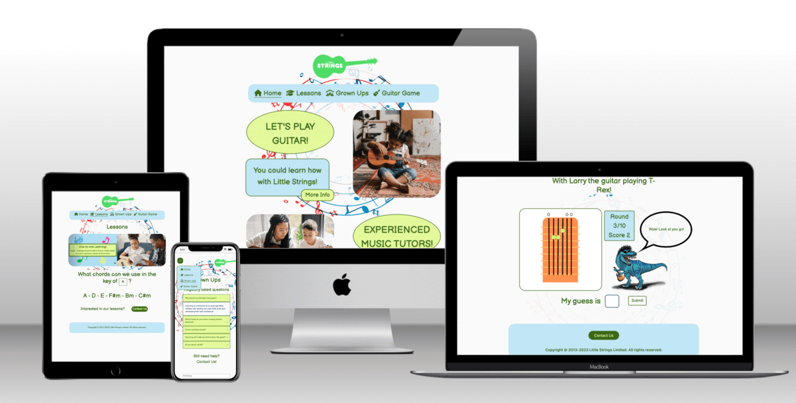

Little Strings is a small business located in Leicester that teaches children and young adults how to play the guitar.

The site contains information about the classes on offer, a Q&A section with a contact form for parents and a fun guitar game for kids!

## Deployment

This web application was built using Gitpod at first, and then moving onto Code Anywhere. Both workspaces were using to git add, commit and push to my repository on GitHub.

Once I had neared completion, I clicked settings and GitHub Pages, changed branch to "Main" and saved. I then placed the URL on my repos description.

[Little Strings](https://ryanmcnally93.github.io/project-two-little-strings/)

## UX

### Project Goal

To engage children and young people with music, showing them how easy it is to learn and fun it is to play.

#### Student Goals

Most children will see this web application being used by parents, or from curiosity will have searched google for it themselves. Either way, they will likely be bored by information in writing and lose interest if things aren't colourful and exciting. The more excited they become about the application, the more likely they are to ask their parents about it, if they don't already know of it.

Rather than creating this product entirely for children it would be good to also target young teenagers, as if they approach it they will be put off by things too chldish looking.

- Learn how to play guitar
- Have fun

| Goals | How are they achieved? |
| :--- | :--- |
| Learn how to play guitar | The key to chord javascript teaches students what chords we can use in every key, the game also teaches students the most basic chord shapes. |
| Have fun | The colours and design features have this in mind, and the game also adds fun to the web application too. |

#### Parent Goals

Parents most importantly need to know their children will be safe in this environment. They also need some knowledge of what their children will learn, and to know the benefits for their child.

- To place my child in a safe learning environment
- To feel at ease with my choice of tutor

| Goals | How are they achieved? |
| :--- | :--- |
| To place my child in a safe learning environment | On the homepage it's explained that the company has over 10 years of experience, any there are questions answered on the accordion. |
| To feel at ease with my choice of tutor | If the parent is not happy with the amount of information given regarding safegarding of tutors they can ask more questions on the contact form. |

#### Developer and Business Goals

Many young children are lost in YouTube and TikTok videos and many parents struggle to find affordable childcare when life means they have to work long hours of the day. This is where Little Strings comes in.

Little Strings is passionate about using that valuable time kids aren't in school or with their parents, to show them that learning is still important away from those environments, and can be really fun.

So many young people aren't sure what they want to be when they grow up or where they want to go. By learning simple chords kids can play along to their favourite songs and it's a skill that they can take with them in life to either perform, teach or work in in other ways in their future.

Kids need to be able to see the benefits of learning, and how it can open doors for them.

- To attract the attention of young people and children
- To teach wherever possible on the web application
- To reassure parents that their children are in a safe, learning environment
- To teach users basic music knowledge like chord shapes

| Goals | How are they achieved? |
| :--- | :--- |
| To attract the attention of young people and children | The design elements are all aimed towards being fun, and the guitar playing dinosaur in particular will be fun for kids|
| To teach wherever possible on the web application | The key to chord selector mixed with the game page have this covered |
| To reassure parents that their children are in a safe, learning environment | Most relevant questions are on the site, and a contact form is there if needed |
| To teach users basic music knowledge like chord shapes | The game successfully teaches users the basic shapes associated with guitar playing, these shapes can be used up and down the fretboard to produce even more chords |

### User Stories

As a child, I want to see:
- Bright colours
- A game to interact with
- Simple imagery, not too busy, basic shapes
- Appropriate content, no improper language usage or slang
- No complicated sentences

I want to:
- Click and play
- Learn instruments

So that:
- I have fun
- I can play my favourite songs

For Teens

- Information as to why music could be good to learn
- One-to-one session availability, so they know that no kids will be running around on their session and escape from parents
- The bright colours and game will interact with their younger side
- To learn guitar, this is a cool thing to teens

As a parent I want to see:
- Interactive learning on the app
- Basic music knowledge on screen
- A child-friendly webpage

I want:
- To be able to contact with questions and worries
- Safety information
- Information on lessons taught
- Site and parking information
- Professionalism
- To know the benefits of learning guitar
- Checks done on tutors

So that:
- I can rest knowing my children are safe
- I know my childs time is being used optimally

### Design Choices

The overall experience needs to be fun, colourful and exciting. I have looked at the following sites for inspiration:

[Fun Bain](https://www.funbrain.com/)

[The Kidz Page](http://thekidzpage.com/)

[Starfall](https://www.starfall.com/h/)

[National Geographic](https://kids.nationalgeographic.com/)

[PBS Kids](https://pbskids.org/)

[Coolmath.com](https://www.coolmath.com/)

From these I can see a consistency in colours, using greens, yellows and blues. Bright solid colours are often used on backgrounds.
I can also see fun, large smooth bubble letters in the fonts used.
Some of these sites even have audio to grab the kids attention.

#### Fonts

- When I put together my project in Balsamiq Wireframes, I was instantly very fond of the default font Balsamiq Sans. It looks like a playful, child-friendly text and goes well with the web application.

#### Icons

- I have decided to use icons in the navbar, which accurately illustrate the word(s) they are next to, and make things easier for children to understand.

#### Colours

- Throughout the sites I looked at, I noticed primary colours being used heavily throughout. Any space deemed "boring" by kids but professional by adults is filled with exciting imagery and colours, and my web application is no exception!
- I have chosen green and blue to grab kids attention, as well as a darker green and blue for text and borders, which change when you hover over them.
- Some elements have also had the green and blue swapped around, to add some difference to the site, and the guitar button of the homepage changes from one to the other when you hover on it.
- The exact shades I used were decided using [Coolors](https://coolors.co/).
- I then used the contrast checker on [Webaim](https://webaim.org/resources/contrastchecker/) to ensure the text was readable.

 

#### Styling

- Curved edges are used a lot, but other shapes have been added to make it more fun. There are oval shapes on the homepage and guitar shapes on the homepage and grown ups page.

- Most of the content is central, with some exceptions appearing on the sides like the guitars on the grown ups page.

- The navbar is more fun with the added icons, and both that and the footer don't take up unnecessary space. Exclamation marks are used throughout the messages to seem more playful.

#### Backgrounds

- An image of a circle of colourful musical notes has been added to each page. The image is interesting and also focusing the users attention to the elements which are mostly in the middle of the page. It is fixed so it remains on screen on all devices.

- Divs with opacity at 0.85% have been put around titles so that the image isn't distracting over them.

#### Images

- The guitar game chord images were created by me on canva, illustrating each chord from A to G, with bright colours.

- There is an image of a dinosaur playing the guitar, who I've given the name Larry, for fun.

- There are guitars made of notes, and relevant images in the carousel. The first is a child being taught, the second, is a group of children in a class, whilst the third is a child practicing at home.

- The images on the front are also related to children and young people playing and learning the guitar.

### Wireframes

These wireframes were created using [Balsamiq Wireframes:](https://balsamiq.com/wireframes/?gad=1&gclid=Cj0KCQjwmN2iBhCrARIsAG_G2i4B-7yK8ylaMm-EgPZyIat6rzJi5BBNRLhY50Ej2SbjAHbQF2LMZocaAj9nEALw_wcB)

[Homepage](/assets/images/readme-images/index-wireframe.png)

[Lessons](/assets/images/readme-images/lessons-wireframe.png)

[Grown Ups](/assets/images/readme-images/grown-ups-wireframe.png)

[Guitar Game](/assets/images/readme-images/guitar-game-wireframe.png)

### Prototype

This prototype of index.html was created on figma.com. From this I designed the original header and footer and colours, a lot of which would later change but gave me something to get started on. I did however keep the styling properties of the divs and of course, the logo.

[Index Prototype](/assets/images/readme-images/figma-prototype.png)

### Q and A of Potential Users

I spoke to three different potential users regarding the website. One was a parent of a young child, one was a 10 year old, and the other was a music teacher. I showed them what I had made and asked them the following questions:

#### Q1 What makes a good website experience for children?

TO DO

Parent of a young child:

- "Response"

Younger person:

- "Response"

Teacher:

- "Response"

#### Q2 What information would you be looking for?

Parent of a young child:

- "Response"

Younger person:

- "Response"

Teacher:

- "Response"

#### Q3 Would you use this?

Parent of a young child:

- "Response"

Younger person:

- "Response"

Teacher:

- "Response"

#### Q4 Why?

Parent of a young child:

- "Response"

Younger person:

- "Response"

Teacher:

- "Response"

#### Q5 What changes can I make?

Parent of a young child:

- "Response"

Younger person:

- "Response"

Teacher:

- "Response"

#### Q6 What other questions might parents have?

Parent of a young child:

- "Response"

Younger person:

- "Response"

Teacher:

- "Response"

#### Q7 What did you think of the game? Could it be improved?

Parent of a young child:

- "Response"

Younger person:

- "Response"

Teacher:

- "Response"

### Competitor Review

Who else is there local to Leicester that has similar goals? Well, I found a few guitar teachers, but none near Leicester aimed specifically towards younger people. Here are three examples.

[John Joslin](https://johnjoslinguitarlessonsleicester.com/)

Pros:

- Looks professional through it's use of colours, not a lot of colour, but stylish greys.
- Excellent reviews section.
- Background images relevant and works well.

Cons:

- Wix.com bar along the top makes it look amateur.
- The title "Guitar Teacher" is written at the top left and this is clearly an error of some sort as it dissappears letter by letter when made smaller.
- All of the information is on one page. The navigation doesn't take you to another page, so if you are on a section, you have to scroll to get back to where you were apart from one button at the very bottom which says back to top.

[Your Guitar Academy](https://yourguitaracademy.com/guitar-lessons-locations/leicester/)

Cons:

- Couldn't even access the site because of a message that says fully booked, which you can't get past unless you enter details. If you haven't engaged the audience, why would they sign up to you?
- Whether they are booked or not, the site should still attempt to show content of some sort. At the very least the fully booked box should have a close tab.

[Intasound](https://www.intasound-music.co.uk/our-services/music-lessons/guitar-lessons/)

Pros:

- The page boasts an extensive list of tutors.

Cons:

- Like looking at a Wikipedia page. All text and space, not much colour or imagery.
- Looks boring, not very artistic.
- Only has basic information about tutors. Some have email links, some don't.

Contacts could've had clickable divs with an image on the front to help sell the tutor.

### Roadmap

This roadmap indicates the importance and viability of specific opportunities.

| Opportunities/Problems      | Importance | Viability   |
| ----------- | ----------- | ----------- |
| Carousel advertising options      | 4       | 5
| Gallery of images from classes    | 2 |5
| Key to chord info   | 3        | 4
| Q&A section for grown ups   | 5        | 5
| Contact form for parents   | 5        | 5
| Game to introduce kids to the guitar   | 4        | 4
| Keyboard game | 3     | 3

## Features 

### Existing Features

- __Navigation Bar__

  - I've opted this time to use a navbar that sits under the logo. The responsiveness of a navbar that sits at the top of a page can be tricky, but also I wanted the options on this page to be more visible than hidden away in a corner, as young children may be using this web application.

- __Footer__

  - I wanted the footer to be fairly symmetrical to the navbar, so gave it the save width, and curved edges.
  
  - On pages where there isn't a link to the contact us section, I've placed a button in the footer.

- __Logo__

  - I created the logo using Canva. I wanted a coloured guitar silhouette with the words "Little Strings" inside, using the font used across the site. This logo isn't too complicated, is to the point, is consistent in colour and text, and looks fun.

  - The colour darkens whenever hovered over.

- __The landing page info boxes__

  - Short sentences, to the point, nothing too complicated for children, with large font.

- __The landing page guitar game button__

  - The guitar game button is massive. It is designed to attract the attention of the younger audience, with the dinosaur image inserted and a colour change on hover.

  - Getting the circles to change colour when hovered was very difficult in css, so I instead wrote some javascript code to get it working.

 

- __The lessons page Carousel__

  - I used the W3Schools bootstrap carousel page for the initial template of my carousel.

  - I decided to split it down the middle and have image on one side and text on the other, so that the images wouldn't distract the text, but also to add some fun illustration to the text side.

  - I added musical notes of varying colours and kept the colour scheme used throughout the site for the text and textbox.
  
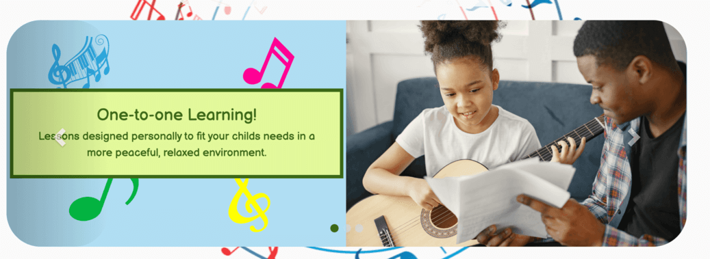

- __The lessons page key to chord searcher__

  - Learning the guitar really is as easy as remembering the six chords you can use in the key you're playing in. As the key you're playing in progresses, so does the chords.

  - I decided to illustrate this in my lessons page, showing to the viewer just how easy it is to understand, from this information we can listen to music, determine what key it is being played in, and play along.

  - As the user clicks on a key, the chords update. If the user has had some lessons and knows how to play these chords, they can play along to their favourite songs!

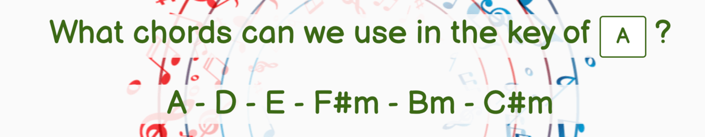

- __The grown ups page accordion__

  - As expected once the question is clicked on the + changes to a - and the message is displayed underneath.

  - I've added some jquery to make the message slide down rather than flash on and off.

  - I've also added some hover css, changing the light colour over from green to blue but keeping the darker colour the same.

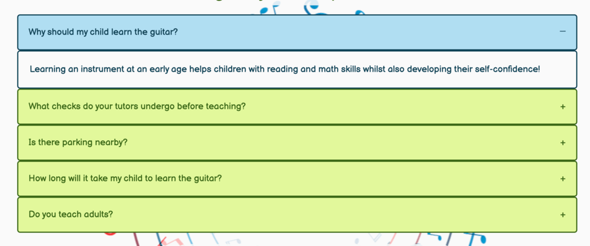

- __The grown ups page contact form__

  - The contact form sits centrally between two guitars made of musical notes.

  - The form works, and sends an email to my email address ryanwinton6@gmail.com.

  - The form also produces a message in green or red to say that the message was sent sucessfully.

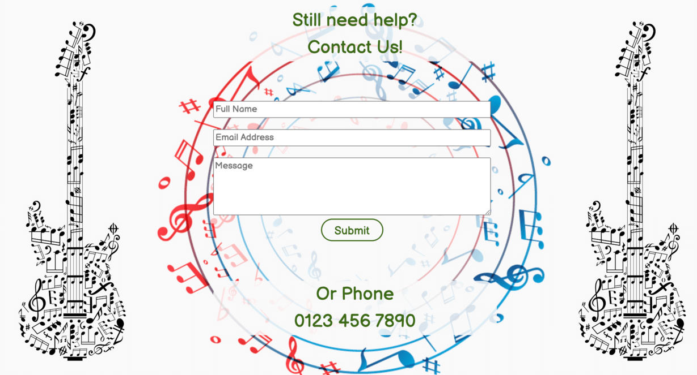

- __The guitar game__

  - This is the opening page, which calls the betweenGameAppearance function:

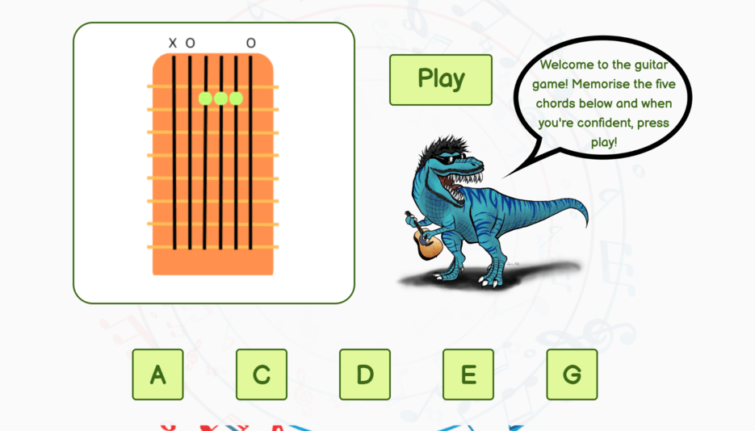

- The user has the choice to select any of the chords, which changes the chord image to its corresponding selection.

- As 'Larry' explains, once the user is comfortable then can click 'Play', which triggers the newGame function. Once the game starts, the chord buttons disappear so the user can't cheat, the play button disappears as it is no longer needed, and the score box becomes visible. There is also a my guess box, which is already focused on and listens for the enter key to be pressed.

- The randomChordGenerator function creates a chord that is different to the last one used, and the changeChord function changes the image so it matches.

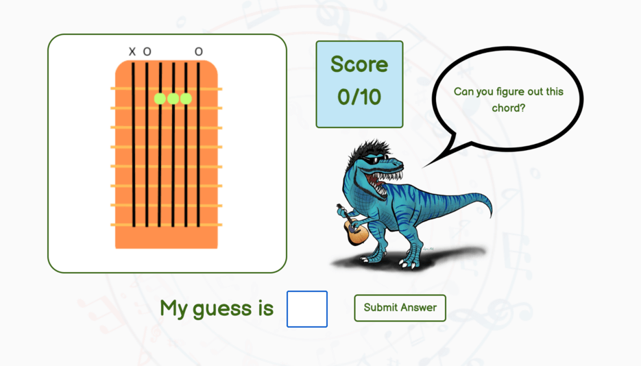

- The first move always displays the same message, and as the user enters correct or incorrect guesses, the checkAnswer function checks the guess and a message is displayed, which again, is different to the last message displayed. This is to let the user know definitely that their answer was indeed checked, there is also a brief shadow property which flashes either green or red depending on the answer given.

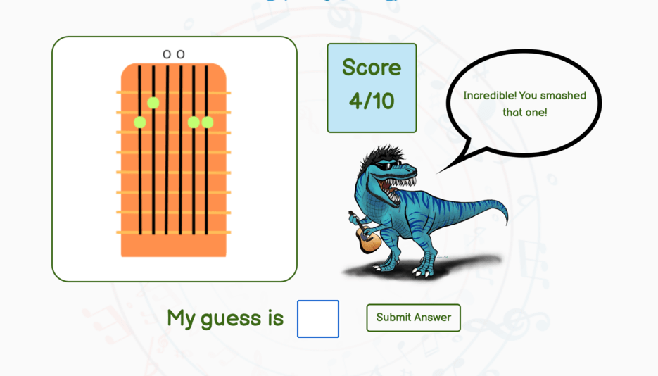

- At the end, the finishGame function looks at the score and gives a supportive message regardless of the outcome, but is different depending on the score.

- Finishing the game also brings back the betweenGameAppearance function, meaning the user can practice and give the game another go if they wish.

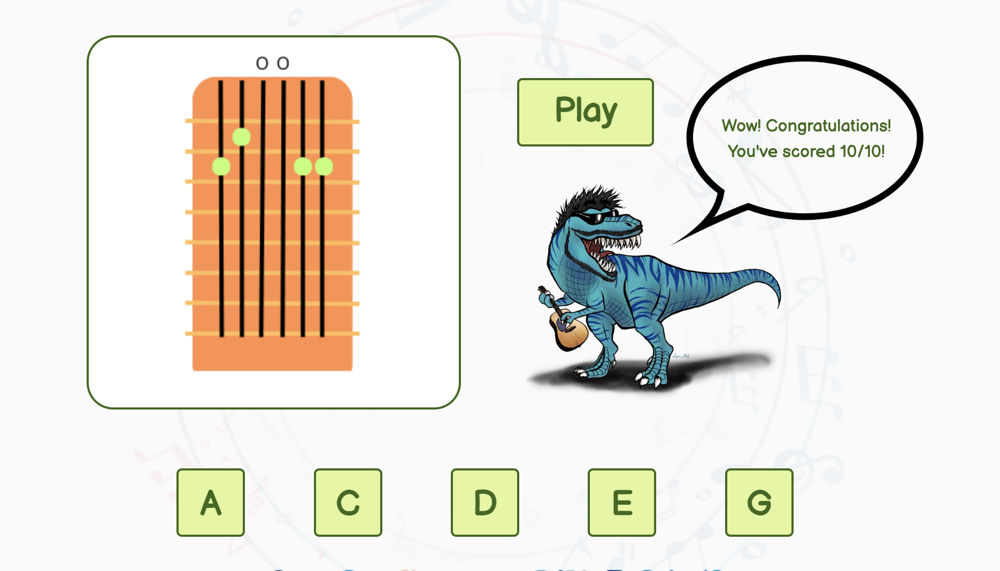

### Features Left to Implement

- __Other Instruments__

    - We could eventually add learning other instruments to the business. The other 'gateway' instrument being keys, which are also easy to learn and used heavily in music MIDI production.

- __Videos__

    - We could add instructive videos to the application so users can learn a little more before committing to the in-person lessons.

## Testing 

I have tested my web application automatically and manually using Test Driven Development and Behaviour Driven Development.

### Automated Testing

### W3C Validation
<!-- DO AT THE END -->

- HTML [W3C validator](https://validator.w3.org/)

  - RESULTS

- CSS [(Jigsaw) validator](https://jigsaw.w3.org/css-validator/)

- RESULTS

<!--

  

-->

### Javascript Validation

This test.js contains 62 automatic tests for the guitar game, which all currently pass.

[Guitar Game Jest Test File](/assets/js/guitar-game-script.test.js)

GROWN-UPS TEST SCRIPT

INDEX TEST SCRIPT

LESSONS TEST SCRIPT

EMAIL TEST SCRIPT

### Lighthouse

<!--AT END RESULTS-->

#### Mobile Lighthouse

<!--AT END RESULTS-->

### Manual Testing

This project has been tested using the following browsers:
<!--Chrome, Safari & Edge-->
On the following devices
Desktop Macbook
Ipad Air Simulator on Dev Tools
Smallest phone size IPhone 5/SE simulator on Dev Tools

`Homepage`

| Feature | Expected Outcome | Testing Performed | Result | Pass/Fail |
| --- | --- | --- | --- | --- |
| Navbar links | Links take user to correct pages, CSS changes on hover | Clicked Links | All four links work, CSS changes on hover | Pass
| All five other buttons (including logo) | Take user to the correct page, CSS changes on hover | Clicked Buttons | All links work and change colour when hovered over | Pass |
| Burger icon on IPhone 5/SE | Item is clickable and navbar readable | Clicked burger icon | Navbar opens vertically, links work | Pass |
| Page layout | Layout changes to accomodate for smaller devices | Opened site on IPhone 5/SE simulator | Every element visible through scrolling, links work | Pass |

`Lessons`

| Feature | Expected Outcome | Testing Performed | Result | Pass/Fail |
| --- | --- | --- | --- | --- |
| The same buttons from Homepage | Take user to the correct page, hover changes CSS | Clicked Buttons | All work, same as homepage | Pass |
| Carousel | Rolls on its own | Waiting upon loading page | Carousel rolls through items | Pass |
| Carousel | Left and Right buttons navigate correctly | Clicked left and right controls | Navigates correctly | Pass |
| Selector | Has options A, C, D, E, G | Clicked Selector | Has correct options | Pass |
| Selector output | When a user chooses a key, the correct chords appear on the line below | Clicked C | The correct 6 chords were shown | Pass |
| IPhone 5/SE carousel | Only has the text side showing, to make content readable | Opened webpage on simulator | Carousel textbox is visible, images are not, carousel works as should | Pass |

`Grown Ups`

| Feature | Expected Outcome | Testing Performed | Result | Pass/Fail |
| --- | --- | --- | --- | --- |
| The same buttons from Homepage | Take user to the correct page, hover changes CSS | Clicked Buttons | All work, same as homepage | Pass |
| Accordion | CSS changes on hover | Hovered over options | CSS changes | Pass |
| Accordions open | When clicked, accordion slides open its input | Clicked on accordion | CSS changes | Pass |
| Accordions close | When opened, clicking on accordion closes them | Clicked on open accordion | It closed | Pass |
| Contact Form and images | They move down when the accordion is opened | Clicked accordions open | The elements moved down with the open accordions | Pass |
| Form | Must have data in all 3 inputs | Tried to submit without | Shows correct error message | Pass |
| Form | Must not accept incorrect email format | Typed different format | Shows correct error message | Pass |
| Submit Button | Send's data, hover changes CSS | Clicked Button | CSS changed, data sent to my email address | Pass |
| Submit Button text | Green successful message is displayed when email is sent | Sent a message | Green message was displayed | Pass |
| IPhone 5/SE contact form section | The guitar of notes images disappear on smaller screens | Opened webpage on simulator | Images were not visible | Pass |

Accordion testing has also been done automatically.

`Guitar Game`

| Feature | Expected Outcome | Testing Performed | Result | Pass/Fail |
| --- | --- | --- | --- | --- |
| The same buttons from Homepage | Take user to the correct page, hover changes CSS | Clicked Buttons | All work, same as homepage | Pass |
| Five chord buttons, play button | CSS changes on hover | Hovered over Element | CSS changes | Pass |
| Five chord buttons, play button | Activate when clicked | Clicked buttons | Chords change image, play button sarts the game | Pass |
| Picture of chord | Green shadow is added when answer is right | Typed in A on a chord | Green shadow was added | Pass |
| Picture of chord | Red shadow is added when answer is wrong | Typed in C on e chord | Red shadow was added | Pass |
| The a chord | Answer is still accepted in uppercase | Typed in "A" on a chord | Game recognised "A" as correct answer | Pass |

In order to test the correct and wrong messages displaying correctly and not repeating, I had to continually test the game by playing it and adding deliberately correct or incorrect answers in a row to see the outcome over 3 games.

The same was done with the random chord generator.

All Guitar Game testing has been done automatically

Manual testing was also completed on the sending of the emails. I have sent various messages using the contact form and receive them at my email address ryanwinton6@gmail.com.

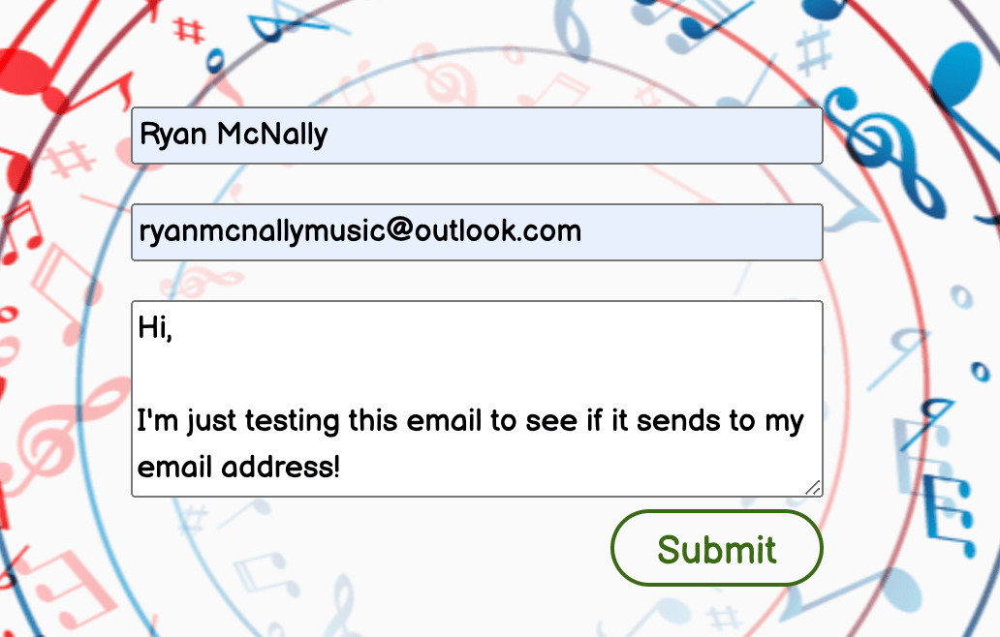

 

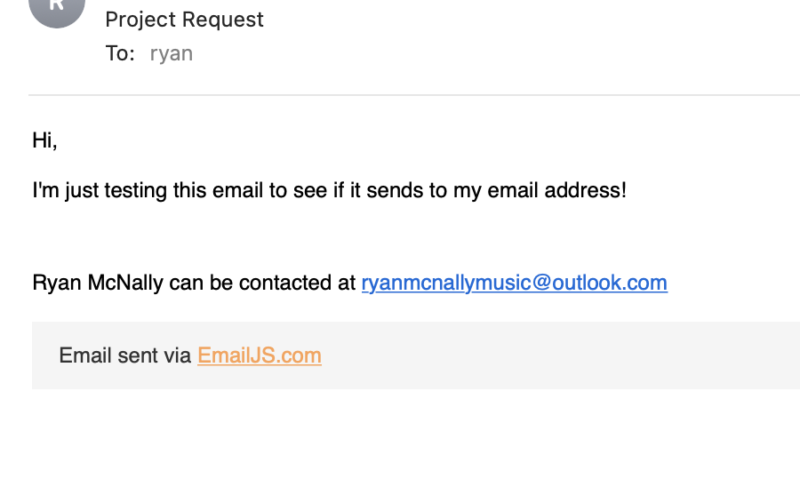

### Fixed Bugs

This is a detailed log of the issues I ran into whilst coding my first project, and how I overcame them.

1). The first issue I found was trying to create the grid layout on my homepage. I spent a while changing classes and moving elements only to realise I'd forgotten to identify the classes as grid areas in css. I then noticed when this still didn't work, that my closing div tag of the homepage-one div was inline with the opening tag, rather than after the content.

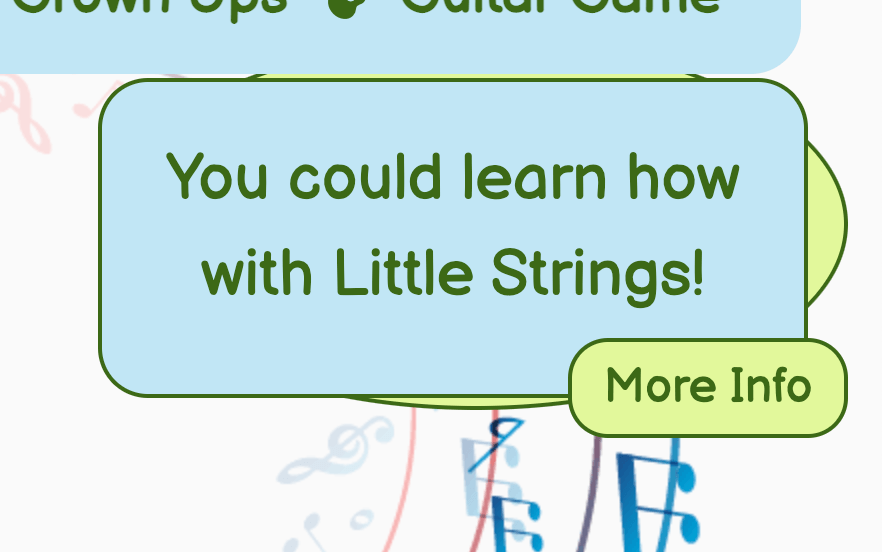

As you can see the images bunched together overlapping and needed fixing.

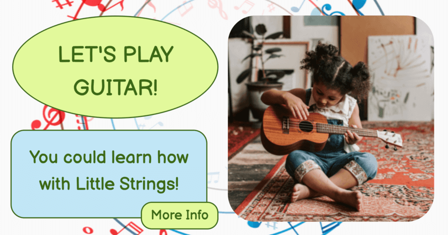

2). The next thing I noticed was that my lessons navbar styling was appearing different than my other pages, even though it had the same code. This is because I've been using bootstrap on my navbar, and have inherited some of its properties. This was only proving to be an issue on my lessons page because in order to get my carousel working, I had to paste a different version of bootstrap into my html's head element. I used dev tools to identify the different styling that was effecting my lessons navbar and corrected the issue that way.

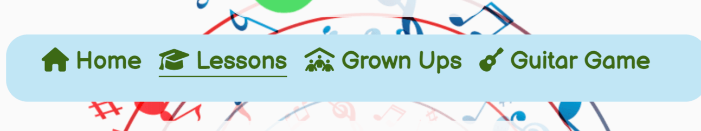

As you can see, the items are at the top of the element, not centered. The issue was fixed after adding this code:

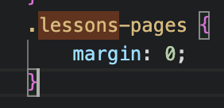

3). A big issue I had with coding the guitar game, came when I tried to use push and splice on an array in JavaScript. Every google fix was the same, make sure you're using the function on an array! I was indeed using the functions on an array, but when I tested the code, I had a fail saying that the push and splice functions didn't exist. I used console.log to try and figure out what was wrong, but it confirmed that I was definitely testing an array.

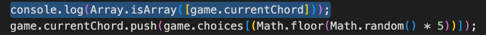

In the end I used the help of a tutor to get to the bottom of the issue, which wasn't my code, but the test itself. The test was using the beforeall function to set the array, which was only containing one piece of data, and I had it set to a string. By setting the array to a string in the test, the test was failing. I changed this to an array, and actually realised later on that this array would only ever hold one piece of data, and so a string was the right way to go about it in the end. I got rid of the push and splice functions and used the equals sign instead.

After this the test passed.

4). During the game sequence, I needed to take my chord image div, and change it. To do so I had to take away the previous class added and add a new one, which proved to be particularly difficult. I used console.log before and after the function so I could see step by step what my code was doing and managed to fix the issue using an if statement. The statement checks the value of new class added, and gets rid of any other potential chord classes, making sure that only the correct chord class is in effect.

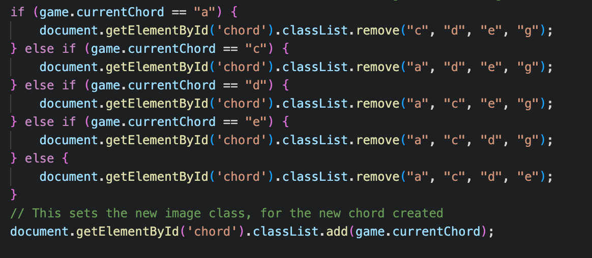

5). My navbars initial repsonsiveness was a nightmare, when I made the screemn size smaller, I'd lose some of the text to the left. When made central it didn't sit right with the logo and at times even overlapped it.

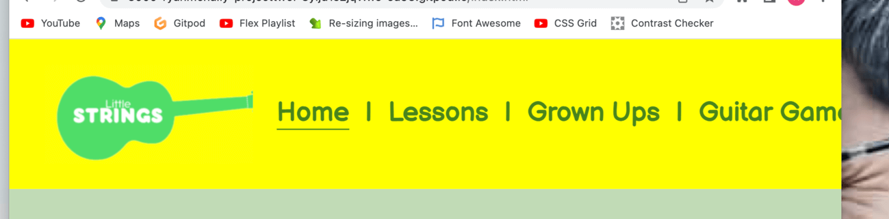

 

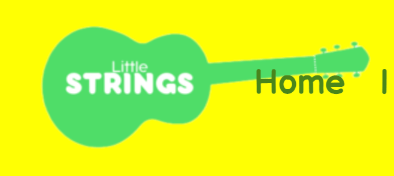

I eventually decided that I wanted a different style of navbar to the one I used in project one anyway. By making the bar 768px including all the items and centering it, it looked great on both IPad and Desktop screens, before being condensed by the burger icon on small screens.

6). I had an issue when trying to make the contact us button travel not just to a different page, but to a specific section on that page. For a while all of my attempts at getting this to work either returned a 404 as I had travelled to a page that didn't exist, or I arrived at the top of the grown-ups page, rather than on the right section.

The fix that finally worked was putting the href "grown-ups.html#contact-us", which now I read it like this, makes a lot of sense!

7). As I created the layout for the guitar game. I had an issue with the speech bubble overlapping Larry. Once I made larry's position "relative" there was an issue with the one element pushing the other down, and eventually this issue.

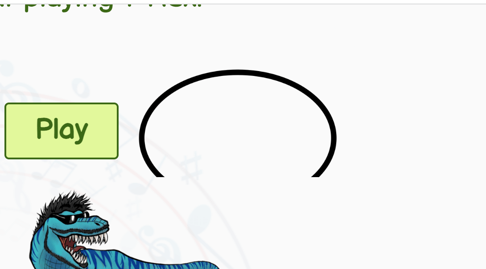

As you can see the speech image is now behind larry. I fixed this by adding position: "absolute" to this and overflow: "hidden".

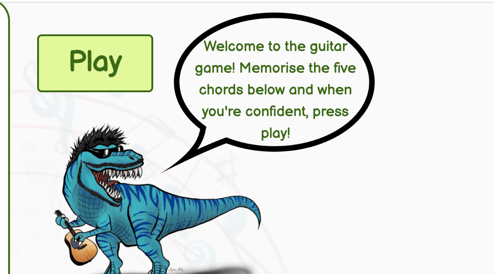

9). When testing the game, I noticed that entering the answers in capital letters (which is how they are displayed throughout the site so may well be how they are entered by users) gave a wrong answer and was not accepted.

I fixed this by adding "lowerAnswer = userAnswer.toLowerCase();" and continuing the code using the output. This worked and both upper and lower case answers are now accepted.

10). The if statement mentioned in bug 4 I felt was a little long-winded. Especially when we have for loops we can use.

In larrysMessage I decided to use a for loop to iterate through the three correct and wrong answers and make sure the correct message is being shown. I expect there is probably a way of doing this with less code but the result is the same either way.

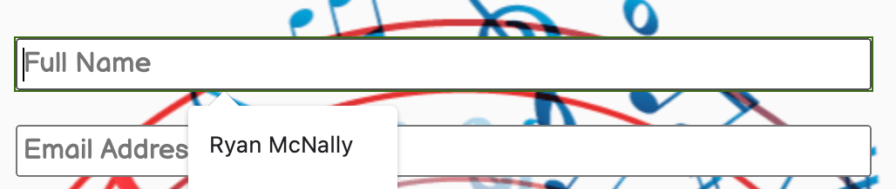

11). blue border after click, because of :focus outline, set to 0 and give rgb property

12). ccsChange // I have used a longer if statement ass opposed to a for loop due to the fact that there are two important classes that I don't want removed.
    // I could still have used a for loop but would probably have been as complicated as this is, and I wanted to show I could achieve the same result
    // in two different ways.
Two tests not working for containing variables in correct and wrong answer arrays. I have screenshot for this one.

13). I had to create two more states in the object game, old message, and new message.
I used strings rather than variables in the correct and wrong choices arrays, defining what they were in the functions instead.
I then created the random message generators, one for wrong, one for right, and two check functions to see if the results obtained were the same as before.
Now, whenever a message is returned that is the same as before, the generator is run again, meaning that the same message does not appear twice in a row.
There may well be a much less exhausting way to do this! But this is the way that I fixed the issue.

14). I had an issue where the accordion just flash showed the result. I added the jquery script to my grown ups page and changed the javascript originally written by W3Schools, adding the jquery code so that they slide up and down instead.

15). On the lessons page, the guitar logo changed colour only when hovered on the very bottom of it. The only difference betweem this and other pages was the bootstrap callings being made to make the carousel work. I tried to place the bootstrap link that I am using on the other pages last, and this worked, however, it changed the carousel indicators. My guess is this css version doesn't support whatever styling was being used on the indicators, so I styled them myself. Now the guitar hover works, and the indicators are better than before, as their colour matches that of the rest of the application.

16). Lessons navbar displaying differently, because of all the bootstrap differences. I added some styling to parts of the navbar (padding right and left on navbardropdown to 0, padding-top 5% to list items, height declarations to stop there being differences on different pages).

17). Tomislav_5P Helped with issue regarding the keys not updating the text underneath on lessons page. adding the change event listener solved this issue.

18). Guitars either side of the form were absolute, which worked fine but when the accordions were clicked, and the form pushed down, the guitars stayed where they were, ruining the layout. I wanted the guitars to not appear above and below the titles, but rather be at the side of them, so I decided to put the titles inside the form, which had width: 33%, meaning the guitars could be position: relative and would move with the accordions.

19). Explain how and why of mouse over and out on index page! Could affect the circles when hovering over the button.

20). I noticed that the burger icon lines were dark originally, not mixing well with my dark green background colour, I fixed this by changing one of the bootstrap classes from "navbar-light" to "navbar-dark", which gave the icon white lines. The button also didn't work, as it was calling on JQuery and that wasn't included within my head element, this has now been fixed.

Once clicked, the items originally presented themselves with the blue background going across the whole page, I fixed this by placing the background colour attibute to the navbar-nav element instead and adding border, padding and width to it.

21). width property on page titles was pushing whole content phone sizes

22). Added javascript for show and in on bootstrap lessons navbar

Game-box made pink, issues with centralisation using trick with %es (https://thoughtbot.com/blog/positioning)
Larry bottom -30px; larrys-speech margin-left 30px;

### Unfixed Bugs

I would have preferred when playing the game on smaller screen sizes, for the whole game including Larry to be visible. As the keyboard rises taking half the screen away, this unfortunately is not possible.

### Responsive Design

#### Ipad Air screen resolution

The index page was mostly kept the same, I changed the width of the navbar so it would accomodate smallest IPad sizes. The only change I made on the lessons page was adding a "br" element to the sentence, which display changes to block when screen size is medium, as at times the question mark was appearing alone on the lower line.

The grown ups page just needed width properties as percentages to make them responsive, the contact form has plenty of room to fill. The guitar game's score box and play button moves underneath the game, so the messages and larry can move closer together.

#### IPhone 5/SE screen resolution

As the burger icon needed space on the left and there isn't much room available, I placed the logo and its box to the right, and both the original image and the hovered one, are also smaller.

On the index page I made all the content central, whilst also making one div show at a time using the grid-template-column and with a percentage width to make it responsive on different phones. On the guitar button I created a second shorter message that displays instead of the original and added some CSS to move the dinosaur and text with the page size until larger.

With the lessons page, I had issues throughout because of the different bootstrap callings made in the head element, that I had to use to get the carousel working. These bootstrap callings were interfering with my original one, and producing different results to that of the other pages. I got rid of the images on the carousel, giving room for the textboxes as they were more important, I also made the text smaller on the key-to-chords section to better suit smaller screen sizes.

The grown ups page was a lot simpler, I removed the guitar of notes to give more room for the contact form, and the accordion worked fine already.

Making the guitar game available on small screens posed a lot of challenges. I first had to change the grid layout to allow for the score, game turn, chord image and answer box to be visible at once. I also made text and images smaller. With Larry, I had to create a different speech bubble. I chose one that sits above him and fills most of the screens width, so to give room to the messages inside.

## Credits 

### Content 

- The code I used for the accordion, I got from [W3S.](https://www.w3schools.com/howto/howto_js_accordion.asp) I used their template and added my own questions and answers.

- The carousel code was also found on [W3S.](https://www.w3schools.com/bootstrap/bootstrap_carousel.asp) This code uses bootstrap classes to achieve the carousel. I decided to create the divs inside the carousel to split it in half, with information as well as pictures, but the code that makes it work is from bootstrap.

- Whenever I needed to crop an image quickly, I used [iloveimg.](https://www.iloveimg.com/crop-image)

- The accordion was originally copied and pasted from [W3S.](https://www.w3schools.com/howto/howto_js_accordion.asp), although changes were made afterwards.

- The email javascipt was written as I followed the Code Institute course videos, and have a lot of similarities.

https://github.com/kera-cudmore/TheQuizArms

https://shields.io/category/analysis

### Media
EXAMPLES
- All of the following images are from pexels.com, below is a list of the image names and the author who posted them on [pexels.com.](https://pexels.com)

- 

- All of the following images are from pngwing.com/ below is a list of the image names and the author who posted them on [pngwing.com.](https://pexels.com)

- 

- Canva creations, chords and logos.

### Acknowledgements

-   My Mentor Jubril Akolade for continuous helpful feedback.

-   My college contact Ben Smith.

-   My other college contact Pasquale Fasulo for his support throughout.

-   Tutor support and the Slack community at Code Institute for their help too, namely Tomislav 5P, OTHERS? and Kera Cudmore who helped answer my questions regularly.

This readme.md was spellchecked using the spell checker extension for Chrome.