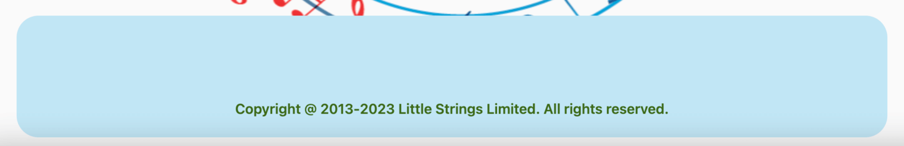
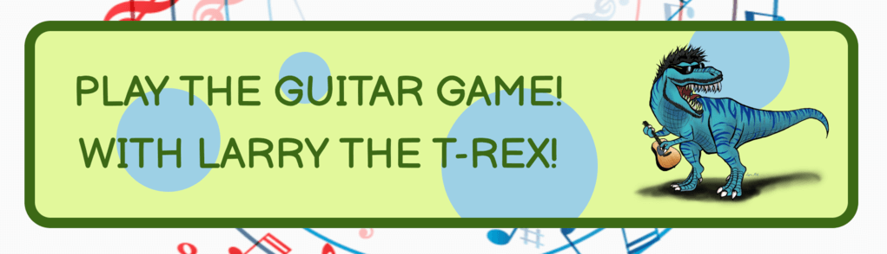

# Little Strings

Little Strings is a small business located in Leicester that teaches children and young adults how to play the guitar.

I have used markdown format for the headers and bullets, links and tables on this readme, but found the img element to be more useful when controlling picture sizes on this document.

<!--MAIN IMAGE NEED TO DO RESPONSIVE DESIGN-->

## UX

### Project Goal

To engage children and young people with music, showing them how easy it is to learn and fun it is to play.

#### Student Goals

Most children will see this web application being used by parents, or from curiosity will have searched google for it themselves. Either way, they will likely be bored by information in writing and lose interest if things aren't colourful and exciting. The more excited they become about the application, the more likely they are to ask their parents about it, if they don't already know of it.

Rather than creating this product entirely for children it would be good to also target young teenagers, as if they approach it they will be put off by things too chldish looking.

- Learn how to play guitar
- Have fun

#### Parent Goals

Parents most importantly need to know their children will be safe in this environment. They also need some knowledge of what their children will learn, and to know the benefits for their child.

- To place my child in a safe learning environment
- To feel at ease with my choice of tutor

#### Developer and Business Goals

Many young children are lost in YouTube and TikTok videos and many parents struggle to find affordable childcare when life means they have to work long hours of the day. This is where Little Strings comes in.

Little Strings is passionate about using that valuable time kids aren't in school or with their parents, to show them that learning is still important away from those environments, and can be really fun.

So many young people aren't sure what they want to be when they grow up or where they want to go. By learning simple chords kids can play along to their favourite songs and it's a skill that they can take with them in life to either perform, teach or work in in other ways in their future.

Kids need to be able to see the benefits of learning, and how it can open doors for them.

- To attract the attention of young people and children
- To teach wherever possible on the web application
- To reassure parents that their children are in a safe, learning environment
- To teach users basic music knowledge like chord shapes

### User Stories

As a child, I want to see:
- Bright colours
- A game to interact with
- Simple imagery, not too busy, basic shapes
- Appropriate content, no improper language usage or slang
- No complicated sentences

I want to:
- Click and play
- Learn instruments

So that:
- I have fun
- I can play my favourite songs

For Teens

- Information as to why music could be good to learn
- One-to-one session availability, so they know that no kids will be running around on their session and escape from parents
- The bright colours and game will interact with their younger side
- To learn guitar, this is a cool thing to teens

As a parent I want to see:
- Interactive learning on the app
- Basic music knowledge on screen
- A child-friendly webpage

I want:
- To be able to contact with questions and worries
- Safety information
- Information on lessons taught
- Site and parking information
- Professionalism
- To know the benefits of learning guitar
- Checks done on tutors

So that:
- I can rest knowing my children are safe
- I know my childs time is being used optimally

### Design Choices

The overall experience needs to be fun, colourful and exciting. I have looked at the following sites for inspiration:

[Fun Bain](https://www.funbrain.com/)

[The Kidz Page](http://thekidzpage.com/)

[Starfall](https://www.starfall.com/h/)

[National Geographic](https://kids.nationalgeographic.com/)

[PBS Kids](https://pbskids.org/)

[Coolmath.com](https://www.coolmath.com/)

From these I can see a consistency in colours, using greens, yellows and blues. Bright solid colours are often used on backgrounds.
I can also see fun, large smooth bubble letters in the fonts used.
Some of these sites even have audio to grab the kids attention.

#### Fonts

- When I put together my project in Balsamiq Wireframes, I was instantly very fond of the default font Balsamiq Sans. It looks like a playful, child-friendly text and goes well with the web application.

#### Icons

- I have decided to use icons in the navbar, which accurately illustrate the word(s) they are next to, and make things easier for children to understand.

#### Colours

- Throughout the sites I looked at, I noticed primary colours being used heavily throughout. Any space deemed "boring" by kids but professional by adults is filled with exciting imagery and colours, and my web application is no exception!
- I have chosen green and blue to grab kids attention, as well as a darker green and blue for text and borders, which change when you hover over them.
- Some elements have also had the green and blue swapped around, to add some difference to the site, and the guitar button of the homepage changes from one to the other when you hover on it.
- The exact shades I used were decided using [Coolors](https://coolors.co/).
- I then used the contrast checker on [Webaim](https://webaim.org/resources/contrastchecker/) to ensure the text was readable.

#### Styling

- Curved edges are used a lot, but other shapes have been added to make it more fun. There are oval shapes on the homepage and guitar shapes on the homepage and grown ups page.

- Most of the content is central, with some exceptions appearing on the sides like the guitars on the grown ups page.

- The navbar is more fun with the added icons, and both that and the footer don't take up unnecessary space. Exclamation marks are used throughout the messages to seem more playful.

#### Backgrounds

- An image of a circle of colourful musical notes has been added to each page. The image is interesting and also focusing the users attention to the elements which are mostly in the middle of the page. It is fixed so it remains on screen on all devices.

- Divs with opacity at 0.85% have been put around titles so that the image isn't distracting over them.

#### Images

- The guitar game chord images were created by me on canva, illustrating each chord from A to G, with bright colours.

- There is an image of a dinosaur playing the guitar, who I've given the name Larry, for fun.

- There are guitars made of notes, and relevant images in the carousel. The first is a child being taught, the second, is a group of children in a class, whilst the third is a child practicing at home.

- The images on the front are also related to children and young people playing and learning the guitar.

### Wireframes

These wireframes were created using Balsamiq:

[Homepage](/assets/images/readme-images/index-wireframe.png)

[Lessons](/assets/images/readme-images/lessons-wireframe.png)

[Grown Ups](/assets/images/readme-images/grown-ups-wireframe.png)

[Guitar Game](/assets/images/readme-images/guitar-game-wireframe.png)

### Prototype

This prototype of index.html was created on figma.com.

[Index Prototype](/assets/images/readme-images/figma-prototype.png)

### Q and A of Potential Users

I spoke to three different potential users regarding the website. One was a parent of a young child, one was a 10 year old, and the other was a music teacher. I showed them what I had made and asked them the following questions:

#### Q1 What makes a good website experience for children?

Parent of a young child:

- "Response"

Younger person:

- "Response"

Teacher:

- "Response"

#### Q2 What information would you be looking for?

Parent of a young child:

- "Response"

Younger person:

- "Response"

Teacher:

- "Response"

#### Q3 Would you use this?

Parent of a young child:

- "Response"

Younger person:

- "Response"

Teacher:

- "Response"

#### Q4 Why?

Parent of a young child:

- "Response"

Younger person:

- "Response"

Teacher:

- "Response"

#### Q5 What changes can I make?

Parent of a young child:

- "Response"

Younger person:

- "Response"

Teacher:

- "Response"

#### Q6 What other questions might parents have?

Parent of a young child:

- "Response"

Younger person:

- "Response"

Teacher:

- "Response"

#### Q7 What did you think of the game? Could it be improved?

Parent of a young child:

- "Response"

Younger person:

- "Response"

Teacher:

- "Response"

### Competitor Review

Who else is there local to Leicester that has similar goals? Well, I found a few guitar teachers, but none near Leicester aimed specifically towards younger people. Here are three examples.

[John Joslin](https://johnjoslinguitarlessonsleicester.com/)

Pros:

- Looks professional through it's use of colours, not a lot of colour, but stylish greys.
- Excellent reviews section.
- Background images relevant and works well.

Cons:

- Wix.com bar along the top makes it look amateur.
- The word "Teacher" is written at the top left and this is clearly an error of some sort.
- All of the information is on one page. The navigation doesn't take you to another page, so if you are on a section, you have to scroll to get back to where you were apart from one button at the very bottom which says back to top.

[Your Guitar Academy](https://yourguitaracademy.com/guitar-lessons-locations/leicester/)

Cons:

- Couldn't even access the site because of a message that says fully booked, which you can't get past unless you enter details. If you haven't engaged the audience, why would they sign up to you?
- Whether they are booked or not, the site should still attempt to show content of some sort. At the very least the fully booked box should have a close tab.

[Intasound](https://www.intasound-music.co.uk/our-services/music-lessons/guitar-lessons/)

Pros:

- The page boasts an extensive list of tutors.

Cons:

- Like looking at a Wikipedia page. All text and space, not much colour or imagery.
- Looks boring, not very artistic.
- Only has basic information about tutors. Some have email links, some don't.

Contacts could've had clickable divs with an image on the front to help sell the tutor.

### Roadmap

This roadmap indicates the importance and viability of specific opportunities.

| Opportunities/Problems      | Importance | Viability   |
| ----------- | ----------- | ----------- |
| Carousel advertising options      | 4       | 5
| Gallery of images from classes    | 2 |5
| Key to chord info   | 3        | 4
| Q&A section for grown ups   | 5        | 5
| Contact form for parents   | 5        | 5
| Game to introduce kids to the guitar   | 4        | 4

<!-- Add other Features -->

## Features 

### Existing Features

- __Navigation Bar__

  - I've opted this time to use a navbar that sits under the logo. The responsiveness of a navbar that sits at the top of a page can be tricky, but also I wanted the options on this page to be more visible than hidden away in a corner, as young children may be using this web application.

- __Footer__

  - I wanted the footer to be fairly symmetrical to the navbar, so gave it the save width, and curved edges.
  
  - On pages where there isn't a link to the contact us section, I've placed a button in the footer.

- __Logo__

  - I created the logo using Canva. I wanted a coloured guitar silhouette with the words "Little Strings" inside, using the font used across the site. This logo isn't too complicated, is to the point, is consistent in colour and text, and looks fun.

  - The colour darkens whenever hovered over.

- __The landing page info boxes__

  - Short sentences, to the point, nothing too complicated for children, with large font.

- __The landing page guitar game button__

  - The guitar game button is massive. It is designed to attract the attention of the younger audience, with the dinosaur image inserted and a colour change on hover.

  - Getting the circles to change colour when hovered was very difficult in css, so I instead wrote some javascript code to get it working.

- __The lessons page Carousel__

  - I used the W3Schools bootstrap carousel page for the initial template of my carousel.

  - I decided to split it down the middle and have image on one side and text on the other, so that the images wouldn't distract the text, but also to add some fun illustration to the text side.

  - I added musical notes of varying colours and kept the colour scheme used throughout the site for the text and textbox.
  
Image

- __The lessons page key to chord searcher__

  - 

Image

- __The grown ups page accordion__

  - 

Image

- __The grown ups page contact form__

  - 

Image

- __The guitar game__

  - 

Image

### Features Left to Implement

- __Other Section__

  What else could you add to this?

  Keyboard?

## Testing 

CONTENTS?

### Automated Testing

### W3C Validation
<!-- DO AT THE END -->

- HTML [W3C validator](https://validator.w3.org/)

  - RESULTS

- CSS [(Jigsaw) validator](https://jigsaw.w3.org/css-validator/)

- RESULTS

<!--

  

-->

### Javascript Validation

This test.js contains 62 automatic tests for the guitar game, which all currently pass.

[Guitar Game Jest Test File](/assets/js/guitar-game-script.test.js)

GROWN-UPS TEST SCRIPT

INDEX TEST SCRIPT

LESSONS TEST SCRIPT

EMAIL TEST SCRIPT

### Lighthouse

RESULTS

#### Mobile Lighthouse

RESULTS

### Manual Testing

#### STUDENT GOALS

| Goals | How are they achieved? |
| :--- | :--- |
| STUDENT GOAL 1 | Stuff |
| STUDENT GOAL 2 | Stuff |
| STUDENT GOAL 3 | Stuff |

#### PARENTS GOALS

| Goals | How are they achieved? |
| :--- | :--- |
| PARENT GOAL 1 | Stuff |
| PARENT GOAL 2 | Stuff |
| PARENT GOAL 3 | Stuff |

#### DEVELOPER GOALS

| Goals | How are they achieved? |
| :--- | :--- |
| DEV GOAL 1 | Stuff |
| DEV GOAL 2 | Stuff |
| DEV GOAL 3 | Stuff |

#### Components

This project has been tested using the following browsers:
EXAMPLE
On the following devices
EXAMPLE

`Homepage`

| Feature | Expected Outcome | Testing Performed | Result | Pass/Fail |
| --- | --- | --- | --- | --- |
| The five Homepage buttons (including icon) | Take user to the correct page, CSS changes on hover | Clicked Buttons | Contact Us Fail | Fail |
| Navbar links | Links take user to correct pages, CSS changes on hover | Clicked Links | All four links work, CSS changes on hover | Pass

`Lessons`

| Feature | Expected Outcome | Testing Performed | Result | Pass/Fail |
| --- | --- | --- | --- | --- |
| The two Lessons buttons (including icon) | Take user to the correct page, hover changes CSS | Clicked Buttons | Contact Us Fail | Fail |
| Navbar links | Links take user to correct pages, CSS changes on hover | Clicked Links | All four links work, CSS changes on hover | Pass
| Carousel | Rolls on its own | Waiting upon loading page | Carousel rolls through items | Pass |
| Carousel | Left and Right buttons navigate correctly | Clicked left and right controls | Navigates correctly | Pass |
| Selector | Has options A, C, D, E, G | Clicked Selector | Has correct options | Pass |

Correct results will be tested automatically.

`Grown Ups`

| Feature | Expected Outcome | Testing Performed | Result | Pass/Fail |
| --- | --- | --- | --- | --- |
| The logo Grown Ups button | Take user to the Homepage, hover changes css | Clicked Buttons | Links correctly, CSS changed | Pass |
| Navbar links | Links take user to correct pages, hover changes CSS | Clicked Links | All four links work, CSS changes on hover | Pass
| Submit Button | Send's data, hover changes CSS | Clicked Button | N/A | N/A |
| Form | Must have data in all 3 inputs | Tried to submit without | Shows correct error message | Pass |
| Form | Must not accept incorrect email format | Typed different format | Shows correct error message | Pass |
| Accordion | CSS changes on hover | Hovered over options | CSS changes | Pass |

Accordion testing has been done automatically.

`Guitar Game`

| Feature | Expected Outcome | Testing Performed | Result | Pass/Fail |
| --- | --- | --- | --- | --- |
| The Guitar Game logo and Contact Us button | Take user to correct pages, hover changes css | Clicked Buttons | Contact Us doesn't work, CSS changed | Fail |
| Navbar links | Links take user to correct pages, hover changes CSS | Clicked Links | All four links work, CSS changes on hover | Pass
| Five chord buttons, play button | CSS changes on hover | Clicked Element | CSS changes | Pass |
| "My Guess" selector | Has correct five options | Clicked Element | Has correct options | Pass |

Guitar Game testing has been done automatically

### Fixed Bugs

This is a detailed log of the issues I ran into whilst coding my first project, and how I overcame them.

1). The first issue I found was trying to create the grid layout on my homepage. I spent a while changing classes and moving elements only to realise I'd forgotten to identify the classes as grid areas in css. I then noticed when this still didn't work, that my closing div tag of the homepage-one div was inline with the opening tag, rather than after the content. Fixing this corrected the issue.

IMAGES.

2). The next thing I noticed was that my lessons navbar styling was appearing different than my other pages, even though it had the same code. This is because I've been using bootstrap on my navbar, and have inherited some of its properties. This was only proving to be an issue on my lessons page because in order to get my carousel working, I had to paste a different version of bootstrap into my html's head element. I used dev tools to identify the different styling that was effecting my lessons navbar and corrected the issue that way.

IMAGES.

3). A bit issue I had with coding the guitar game, came when I tried to use push and splice on an array in JavaScript. Every google fix was the same, make sure you're using the function on an array! I was indeed using the functions on an array, but when I tested the code, I had a fail saying that the push and splice functions didn't exist. I used console.log to try and figure out what was wrong, but it confirmed that I was definitely testing an array.

In the end I used the help of a tutor to get to the bottom of the issue, which wasn't my code, but the test itself. The test was using the beforeall function to set the array, which was only containing one piece of data, and I had it set to a string. By setting the array to a string in the test, the test was failing. I changed this to an array, and actually realised later on that this array would only ever hold one piece of data, and so a string was the right way to go about it in the end. I got rid of the push and splice functions and used the equals sign instead.

IMAGES

4). During the game sequence, I needed to take my chord image div, and change it. To do so I had to take away the previous class added and add a new one, which proved to be particularly difficult. I used console.log before and after the function so I could see step by step what my code was doing and managed to fix the issue using an if statement. The statement checks the value of new class added, and gets rid of any other potential chord classes, making sure that only the correct chord class is in effect.

IMAGES

5). Navbar responsiveness.

IMAGES

6). Contact us buttons, going down the page.

IMAGES

7). Overflow: hidden helped when setting my grid on guitar game, means things can overlap so speech bubble can overlap larry

8). struggled with concept of columns and rows and realised i had wrong calling - speech instead of larrys speech

9). lowerAnswer = userAnswer.toLowerCase(); fixed the issue of capital letters not being accepted

10). used the for loop to iterate through the three correct and wrong answers and make sure the correct message is being shown, rather than use the long-winded way used earlier.

11). blue border after click, because of :focus outline, set to 0 and give rgb property

12). ccsChange // I have used a longer if statement ass opposed to a for loop due to the fact that there are two important classes that I don't want removed.
    // I could still have used a for loop but would probably have been as complicated as this is, and I wanted to show I could achieve the same result
    // in two different ways.
Two tests not working for containing variables in correct and wrong answer arrays. I have screenshot for this one.

13). I had to create two more states in the object game, old message, and new message.
I used strings rather than variables in the correct and wrong choices arrays, defining what they were in the functions instead.
I then created the random message generators, one for wrong, one for right, and two check functions to see if the results obtained were the same as before.
Now, whenever a message is returned that is the same as before, the generator is run again, meaning that the same message does not appear twice in a row.
There may well be a much less exhausting way to do this! But this is the way that I fixed the issue.

14). I had an issue where the accordion just flash showed the result. I added the jquery script to my grown ups page and changed the javascript originally written by W3Schools, adding the jquery code so that they slide up and down instead.

15). On the lessons page, the guitar logo changed colour only when hovered on the very bottom of it. The only difference betweem this and other pages was the bootstrap callings being made to make the carousel work. I tried to place the bootstrap link that I am using on the other pages last, and this worked, however, it changed the carousel indicators. My guess is this css version doesn't support whatever styling was being used on the indicators, so I styled them myself. Now the guitar hover works, and the indicators are better than before, as their colour matches that of the rest of the application.

16). Lessons navbar displaying differently, because of all the bootstrap differences. I added some styling to parts of the navbar (padding right and left on navbardropdown to 0, padding-top 5% to list items, height declarations to stop there being differences on different pages).

17). Tomislav_5P Helped with issue regarding the keys not updating the text underneath on lessons page. adding the change event listener solved this issue.

18). Guitars either side of the form were absolute, which worked fine but when the accordions were clicked, and the form pushed down, the guitars stayed where they were, ruining the layout. I wanted the guitars to not appear above and below the titles, but rather be at the side of them, so I decided to put the titles inside the form, which had width: 33%, meaning the guitars could be position: relative and would move with the accordions.

19). Explain how and why of mouse over and out on index page! Could affect the circles when hovering over the button.

### Unfixed Bugs

There are no bugs unfixed to my knowledge.

## Deployment
<!--
THIS MAY HAVE TO BE THE SAME?!

This project was developed using Gitpod, committed to git and pushed using the built in function within Gitpod.

To deploy this page, I followed the following steps.

1. Log into GitHub.

2. Select project-one-relieve from list of repositories.

3. From the top menu items, select settings.

4. Select Pages from the left hand side menu.

5. Under Source click the drop-down menu labelled None and select main.

6. On selecting main the page is automatically refreshed, the website is now deployed.

7. Scroll back down to the GitHub Pages section to retrieve the link to the deployed website.

At the time of submitting this project, the Development Branch and Master Branch were identical.

To clone you will need

1. A [GitHub](https://github.com/) account.

2. The [Chrome](https://www.google.com/intl/en_uk/chrome/) browser.

Then follow the following steps:

1. Install the Gitpod Browser Extension for Chrome.

2. After installation, restart the browser.

3. Log into Gitpod with your account.

4. Navigate to the Project GitHub repository.

5. Click the green Gitpod button in the top right corner of the repository.

6. A new Gitpod workplace will created from the code in github where you can work locally.

To work on the project code within a local IDE such as VSCode, Python, etc.

1. Follow [this link](https://github.com/ryanmcnally93/project-one-relieve) to the Project GitHub repository.

2. Under the repository name, click "Clone the download".

3. In the clone with HTTPs section, copy the clone URL for the repository.

4. In your local IDE open the terminal.

5. Change the current working directory to the location where you want the cloned directory to be made.

6. Type git clone, and then paste the URL you copied in Step 3.

7. Press Enter. Your local clone will be created.

The site had no broken links, but the images wouldn't show initially. I had to change the style.css background URL's to include "/project-one-relieve/" and after that they worked correctly.-->

## Credits 

### Content 

- The code I used for the accordion, I got from [W3S.](https://www.w3schools.com/howto/howto_js_accordion.asp) I used their template and added my own questions and answers.

- The carousel code was also found on [W3S.](https://www.w3schools.com/bootstrap/bootstrap_carousel.asp) This code uses bootstrap classes to achieve the carousel. I decided to create the divs inside the carousel to split it in half, with information as well as pictures, but the code that makes it work is from bootstrap.

- Whenever I needed to crop an image quickly, I used [iloveimg.](https://www.iloveimg.com/crop-image)

- The accordion was originally copied and pasted from [W3S.](https://www.w3schools.com/howto/howto_js_accordion.asp), although changes were made afterwards.

- The email javascipt was written as I followed the Code Institute course videos, and have a lot of similarities.

### Media
EXAMPLES
- All of the following images are from pexels.com, below is a list of the image names and the author who posted them on [pexels.com.](https://pexels.com)
<!--
- index-hero.jpeg, small-index.jpeg - [Gustavo Fring.](https://www.pexels.com/@gustavo-fring/)-->
- Don't forget Larry!

### Acknowledgements

-   My Mentor Jubril Akolade for continuous helpful feedback.

-   My college contacts Ben Smith and Pasquale Fasulo for his support throughout. 

-   Tutor support and the Slack community at Code Institute for their help too.

## Lighthouse Scores
EXAMPLE
<!--
[Homepage](/assets/images/readme-images/home-lighthouse.png)

[Benefits](/assets/images/readme-images/benefits-lighthouse.png)

[Classes](/assets/images/readme-images/classes-lighthouse.png)

[Sign up](/assets/images/readme-images/signup-lighthouse.png)-->

This readme.md was spellchecked using the spell checker extension for Chrome.